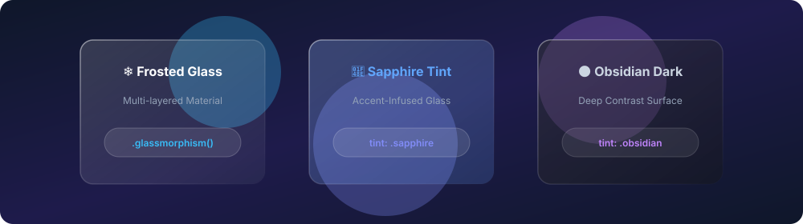

# SwiftUI Glassmorphism ❄️

A GPU-accelerated frosted glass blur, border gradient highlight, and layered surface library for SwiftUI on iOS 16+ & macOS 13+.

[](https://swift.org)
[](https://developer.apple.com)
[](https://swift.org/package-manager/)
[](LICENSE)

<p align="center">
  
</p>

---

## 🌟 Features

- 💎 **Layered Materials**: Blends `.ultraThinMaterial` with configurable color tints and ambient back-drop lighting.
- 📐 **Dynamic Gradient Strokes**: Renders directional lighting highlights along borders to simulate real optical glass refraction.
- 🎨 **Preset Tints**: Includes `.frosted`, `.sapphire`, `.emerald`, and `.obsidian` presets.
- 📦 **Plug & Play**: Simple `.glassmorphism()` modifier or declarative `GlassCard` container.

---

## 🚀 Installation

Add **Glassmorphism** to your project dependencies via Swift Package Manager:

```swift
dependencies: [
    .package(url: "https://github.com/nilkanthdesai76/swiftui-glassmorphism.git", from: "1.0.0")
]
```

---

## 💻 Quick Start

### 1. View Modifier

```swift
import SwiftUI
import Glassmorphism

struct DashboardCard: View {
    var body: some View {
        VStack(alignment: .leading, spacing: 10) {
            Label("System Status", systemImage: "bolt.shield")
                .font(.headline)
            Text("All background services operational.")
                .font(.subheadline)
                .foregroundColor(.secondary)
        }
        .padding(20)
        .glassmorphism(cornerRadius: 18, tint: .sapphire)
    }
}
```

### 2. Ready-to-Use `GlassCard`

```swift
import SwiftUI
import Glassmorphism

struct ProfileView: View {
    var body: some View {
        GlassCard(cornerRadius: 20, tint: .obsidian) {
            HStack(spacing: 16) {
                Image(systemName: "person.crop.circle.fill")
                    .font(.system(size: 44))
                VStack(alignment: .leading) {
                    Text("Nilkanth Desai")
                        .font(.headline)
                    Text("Apple Platforms Engineer")
                        .font(.caption)
                        .foregroundColor(.secondary)
                }
            }
        }
    }
}
```

---

## 🧪 Testing

Run test suite via Swift CLI:

```sh
swift test
```

---

## 📄 License

This project is licensed under the MIT License - see the [LICENSE](LICENSE) file for details.
